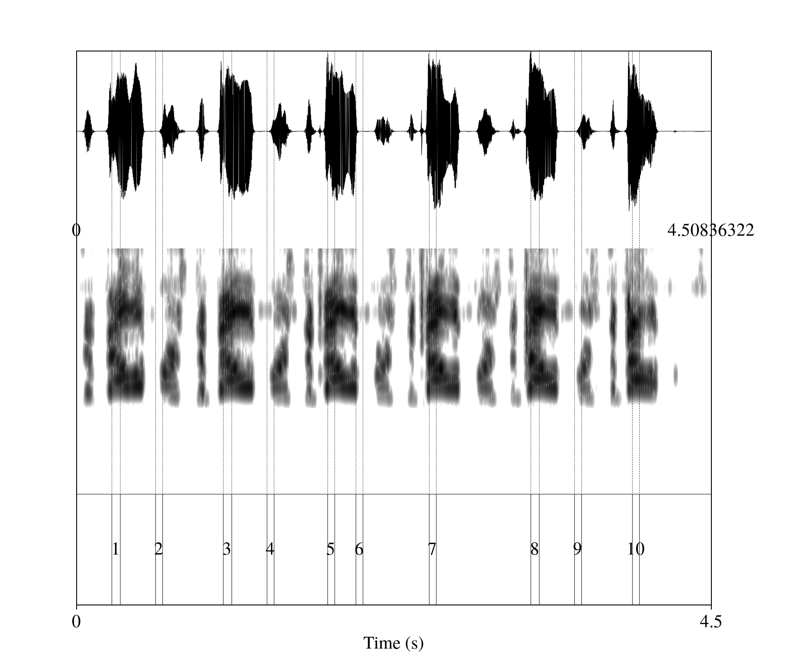
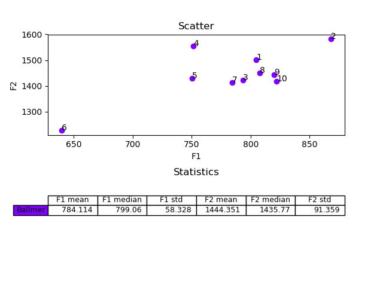

# AutoPRAAT

## Overview

This project was made to assist speech analysis using Praat by automating various processes.

Using a Praat script and a supplementary Python script, you can extract data from a sound in Praat to a file which can then be passed to other utilities in the project for manipulation.

## Prerequisites

You'll need Praat and Python 3 installed on your computer. The Python scripts require the `numpy` and `pandas` packages. At the moment, running the Python scripts requires knowledge of how to run Python scripts from the command line. In the future, a more user-friendly interface may be added.

## How to use

### Step 1: extracting raw formant data from Praat

In this step, we'll run a Praat script on the sound to be analyzed which will extract the mean formants on constant intervals throughout the sounds and write them to a `csv` file that can later be analyzed. To do this:

* Open the sound from which the data is to be extracted in Praat (`Open` -> `Read from file...` or *Ctrl+O*).
* Open the script `get_formants.praat` (`Praat` -> `Open Praat script...`). A new window containing the script will open.
* If you want to change the sampling interval from the default 10 milliseconds, change the duration in the line `interval = 0.01` to the desired duration.
* If needed, change the maximal frequency (default is 5500 Hz) in the line `To Formant (burg)... 0 5 5500 0.025 50` to better suit the analyzed speaker. 5500 Hz (the default) is recommended for female speakers; 5000 for male speakers.
* In the `Praat Objects` window, select the sound from which the data is to be extracted.
* In the script window, run the script (`Run` -> `Run` or *Ctrl+R*). Choose the name and location of the `csv` file created by the script when requested. Notice that the script may take a short while to run.
* The file created by the script contains the raw data retrieved from the selected sound and can be opened in Excel, for example.

### Step 2: extending the data

Once we have the raw formant data, we can extend it to contain mean formant values over several intervals using the script `extend_data.py`. Unless specified otherwise, the script adds formant data for multiples of 1 to 10 of intervals; for example, if in step 1 we extracted mean formants for every 10 milliseconds, the script will calculate mean formants for intervals of 20, 30, 40, ..., 100 milliseconds. To specify a different set of interval multiples, pass three arguments of the form `start stop step` to the script; for example, for the default behavior shown before, pass `1 10 1`:

```
python3 extend_data.py formants.csv 1 10 1
```

Where `formants.csv` is the `csv` file generated in step 1. The script will create a new file in the same location as the input file; for example, in the case shown above, a file `formants_extended.csv` will be created.

### Step 3: running a utility on the data

Once data has been extracted from Praat to a `csv` file in steps 1 and 2, it can be passed to the main script, `autopraat.py` for various utilities. We give some examples here; for the full list of features, run `python3 autopraat.py --help`; for help on a specific utility, run `autopraat.py <utility> --help`, where `<utility>` is the utility name. Utilities do not modify the input `csv` file, so steps 1 and 2 can be run once for each sound analyzed (unless changes in the data resolution specified in step 2 are required).

#### Building a TextGrid with formant filters

Using the `formant_filter` utility, we can build a Praat TextGrid file for the analyzed sound, where boundaries will be set to mark intervals where there are certain mean formant values. For example, to build a TextGrid where intervals of length at least 50 milliseconds long and a mean F1 value of 700 to 800 Hz are marked, run:

```
python3 autopraat.py formant_filter formants_extended.csv newTextGrid.TextGrid 50 -f1 700-800
```

This will create the TextGrid file `newTextGrid.TextGrid` with the desired data. The script refuses to overwrite existing files by default; to overwrite files, pass the `--overwrite` flag.

If you want several tiers, with each tier corresponding to a different set of formant constraints, you can pass the script a `csv` file of the following format:

```
700-800,1000-1500,,,
600-650,,2500-2800,,
```

Passing this file (using `--formant-file`) will create a TextGrid with two tiers: the first will mark intervals where F1 is in the range 700-800 Hz and F2 is in the range 1000-1500 Hz; the second will mark intervals where F1 is in the range 600-650 Hz and F3 is in the range 2500-2800 Hz. Notice that all five formant fields should be included in each line, and can be left empty if no constraints are needed.

#### Drawing a scatter plot

Using the `formant_scatter` utility, we can draw a scatter plot from a TextGrid file, or from several such files. The utility receives data files (`csv` files generated in step 2) and corresponding TextGrid files with annotated intervals (intervals with text) and a specification of two values to be displayed in the axes of the scatter plot. Values can be any formant (1-5), segment duration or time. For example:

```
python3 autopraat.py formant_scatter formants_extended.csv text_grid.TextGrid 12
```

This command will display a scatter plot of the segments marked in `text_grid.TextGrid` (corresponding to the sound whose data is in `formants_extended.csv`), where the horizontal axis denotes F1 and the vertical axis denotes F2. It will also draw a table with the mean value and standard deviation of each axis.

## Demonstration

### The `formant_filter` utility

For example, using Steve Ballmer as a guest speaker repeating the word "developers" six times ([link](https://www.youtube.com/watch?v=EMldOiiG1Ko)):


We find upon inspection of the first /ɛ/ ("de**vel**opers") that its first three formants are about 847, 1527, 2735 Hz.

Extracting the formants and extending them (steps 1 and 2 above) and applying step 3 to the resulting `ballmer_extended.csv` file thus:

```
python3 autopraat.py formant_filter ballmer_extended.csv ballmer.TextGrid 50 -f1 750-900 -f2 1400-1600 -f3 2500-2800
```

Yields the following TextGrid (`ballmer.TextGrid`):



Where all six /ɛ/ phones are marked (intervals 1, 3, 5, 7, 8 and 10), with a few false-positives where background noise happens to give similar formant values in Praat (a less noisy recording would lead to fewer errors).

### The `formant_scatter` utility

Using the same sound from above and the resulting TextGrid file, we plot F1 and F2 (this is an example of only one TextGrid being plotted; several different TextGrids can be plotted in the same graph if needed).

```
python3 autopraat.py formant_scatter ballmer_extended.csv ballmer.TextGrid 12 --annotate
```

